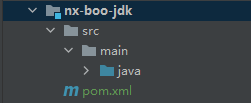
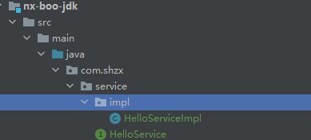
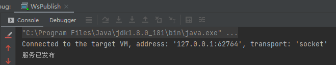
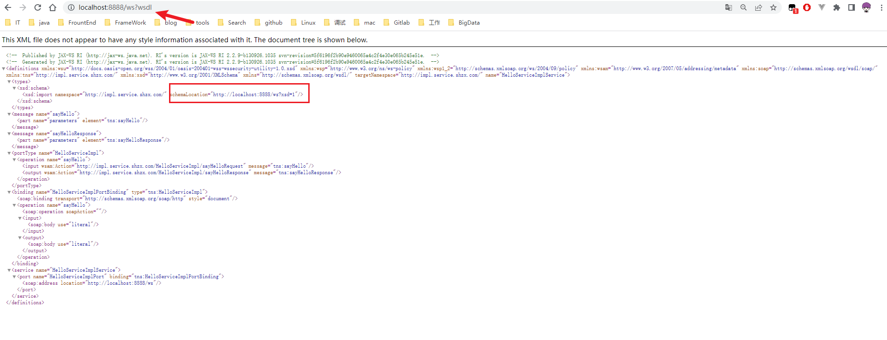
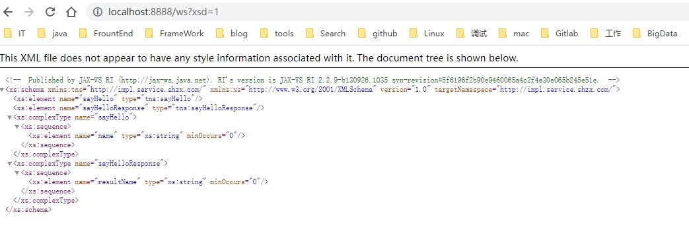
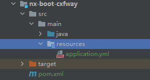
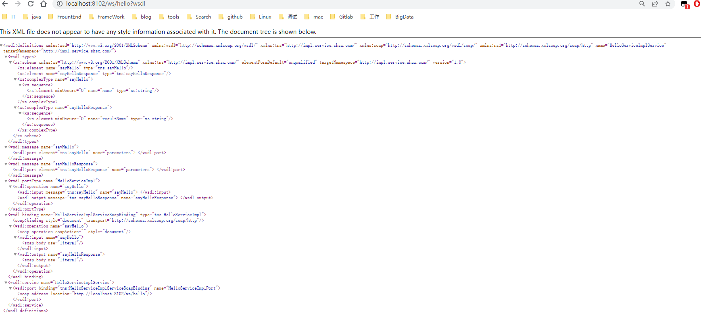
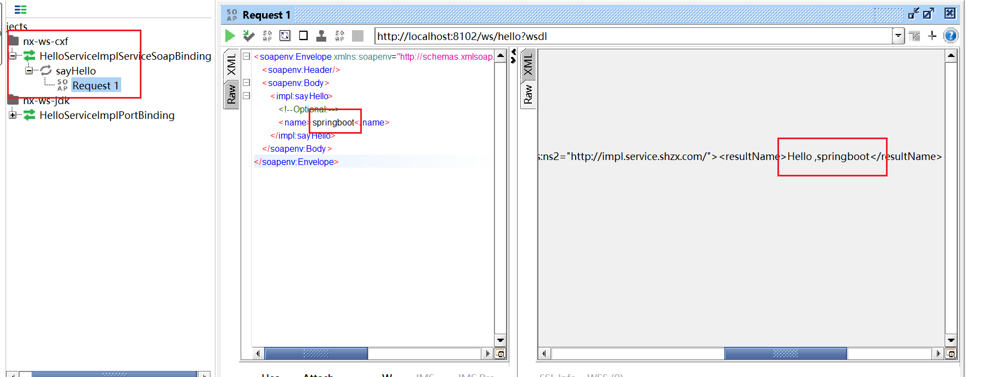

####                                                      SpringBoot整合WebService

##### 一、使用JDK自带的JAX-WS发布WebService服务

1、通过maven创建普通的java项目



2、编写接口和实现类:



HelloService.java接口

```java
package com.shzx.service;

/**
 * @description:
 * @author: rsb
 * @description: 2023-06-20-16-36
 * @description:
 * @Version: 1.0.0
 */
public interface HelloService {
    String sayHello(String name);
}
```

HelloService的实现HelloServiceImpl.java

```java
package com.shzx.service.impl;

import com.shzx.service.HelloService;

import javax.jws.WebMethod;
import javax.jws.WebParam;
import javax.jws.WebResult;
import javax.jws.WebService;

/**
 * @description:
 * @author: rsb
 * @description: 2023-06-20-16-36
 * @description: 使用JDK自带的 JAX-WS 发布WebService服务
 * @Version: 1.0.0
 */
@WebService
public class HelloServiceImpl implements HelloService {
    @WebMethod
    @WebResult(name = "resultName")
    @Override
    public String sayHello(@WebParam(name = "name") String name) {
        return "Hello ," + name;
    }
}
```

编写启动类WsPublish.java

```java
package com.shzx;

import com.shzx.service.impl.HelloServiceImpl;

import javax.xml.ws.Endpoint;

/**
 * @description:
 * @author: rsb
 * @description: 2023-06-20-16-40
 * @description: 使用JDK自带的 JAX-WS 发布WebService服务
 * @Version: 1.0.0
 */
public class WsPublish {
    public static void main(String[] args) {
        String address = "http://localhost:8888/ws";
        Endpoint.publish(address,new HelloServiceImpl());
        System.out.println("服务已发布");
    }
}
```

启动项目



访问发布的地址，记得加上wsdl



然后再访问schemaLocation指向的地址:http://localhost:8888/ws?xsd=1



##### 二、使用CXF发布WebService服务

1、创建nx-boot-cxfway模块



pom.xml

```xml
<?xml version="1.0" encoding="UTF-8"?>

<project xmlns="http://maven.apache.org/POM/4.0.0" xmlns:xsi="http://www.w3.org/2001/XMLSchema-instance"
         xsi:schemaLocation="http://maven.apache.org/POM/4.0.0 http://maven.apache.org/xsd/maven-4.0.0.xsd">
    <parent>
        <groupId>org.springframework.boot</groupId>
        <artifactId>spring-boot-starter-parent</artifactId>
        <version>2.6.3</version>
        <relativePath/> <!-- lookup parent from repository -->
    </parent>

    <modelVersion>4.0.0</modelVersion>
    <groupId>com.shzx</groupId>
    <artifactId>nx-boot-cxfway</artifactId>
    <version>1.0-SNAPSHOT</version>

    <name>nx-boot-cxfway</name>
    <!-- FIXME change it to the project's website -->
    <url>http://www.example.com</url>

    <properties>
        <maven.compiler.source>8</maven.compiler.source>
        <maven.compiler.target>8</maven.compiler.target>
    </properties>

    <dependencies>

        <!-- https://mvnrepository.com/artifact/com.alibaba/fastjson -->
        <dependency>
            <groupId>com.alibaba</groupId>
            <artifactId>fastjson</artifactId>
            <version>1.2.79</version>
        </dependency>


        <!--WebService CXF依赖 begin-->
        <dependency>
            <groupId>org.apache.cxf</groupId>
            <artifactId>cxf-spring-boot-starter-jaxws</artifactId>
            <version>3.5.0</version>
        </dependency>

        <dependency>
            <groupId>org.apache.cxf</groupId>
            <artifactId>cxf-rt-frontend-jaxws</artifactId>
            <version>3.5.0</version>
        </dependency>

        <dependency>
            <groupId>org.apache.cxf</groupId>
            <artifactId>cxf-rt-transports-http</artifactId>
            <version>3.5.0</version>
        </dependency>
        <!--WebService CXF依赖 end-->

        <dependency>
            <groupId>org.springframework.boot</groupId>
            <artifactId>spring-boot-starter-thymeleaf</artifactId>
        </dependency>
        <dependency>
            <groupId>org.springframework.boot</groupId>
            <artifactId>spring-boot-starter-web</artifactId>
        </dependency>

        <dependency>
            <groupId>org.springframework.boot</groupId>
            <artifactId>spring-boot-devtools</artifactId>
            <scope>runtime</scope>
            <optional>true</optional>
        </dependency>
        <dependency>
            <groupId>mysql</groupId>
            <artifactId>mysql-connector-java</artifactId>
            <scope>runtime</scope>
        </dependency>
        <dependency>
            <groupId>org.springframework.boot</groupId>
            <artifactId>spring-boot-configuration-processor</artifactId>
            <optional>true</optional>
        </dependency>
        <dependency>
            <groupId>org.projectlombok</groupId>
            <artifactId>lombok</artifactId>
            <optional>true</optional>
        </dependency>
        <dependency>
            <groupId>org.springframework.boot</groupId>
            <artifactId>spring-boot-starter-test</artifactId>
            <scope>test</scope>
        </dependency>
    </dependencies>

    <build>
        <plugins>
            <plugin>
                <groupId>org.springframework.boot</groupId>
                <artifactId>spring-boot-maven-plugin</artifactId>
                <configuration>
                    <excludes>
                        <exclude>
                            <groupId>org.projectlombok</groupId>
                            <artifactId>lombok</artifactId>
                        </exclude>
                    </excludes>
                </configuration>
            </plugin>
        </plugins>
    </build>
</project>

```

2、application.yml配置

```java
server:
  port: 8102
spring:
  application:
    name: nx-boot-cxfway
  #遇到相同类名覆盖注册
  main:
    allow-bean-definition-overriding: true
# 集成cxf,默认：cxf.path=/services
cxf:
  path: /ws
```

3、编写启动类: Main.java

```java
package com.shzx;

import org.springframework.boot.SpringApplication;
import org.springframework.boot.autoconfigure.SpringBootApplication;

/**
 * @description:
 * @author: rsb
 * @description: 2023-06-20-16-13
 * @description:
 * @Version: 1.0.0
 */
@SpringBootApplication
public class Main {
    public static void main(String[] args) {
        SpringApplication.run(Main.class, args);
    }
}

```

3、编写接口

```java
package com.shzx.service;

/**
 * @description:
 * @author: rsb
 * @description: 2023-06-20-16-36
 * @description:
 * @Version: 1.0.0
 */
public interface HelloService {
    String sayHello(String name);
}
```

4、编写实现类: HelloServiceImpl.java

```java
package com.shzx.service.impl;

import com.shzx.service.HelloService;
import org.springframework.stereotype.Service;

import javax.jws.WebMethod;
import javax.jws.WebParam;
import javax.jws.WebResult;
import javax.jws.WebService;

/**
 * @description:
 * @author: rsb
 * @description: 2023-06-20-16-36
 * @description: 使用JDK自带的 JAX-WS 发布WebService服务
 * @Version: 1.0.0
 */
@WebService
@Service
public class HelloServiceImpl implements HelloService {
    @WebMethod
    @WebResult(name = "resultName")
    @Override
    public String sayHello(@WebParam(name = "name") String name) {
        return "Hello ," + name;
    }
}
```

5、编写配置类: CxfConfig.java

```java
package com.shzx.config;

import com.shzx.service.impl.HelloServiceImpl;
import org.apache.cxf.Bus;
import org.apache.cxf.jaxws.EndpointImpl;
import org.springframework.beans.factory.annotation.Autowired;
import org.springframework.context.annotation.Bean;
import org.springframework.context.annotation.Configuration;
import javax.xml.ws.Endpoint;

/**
 * description: CXF服务发布配置
 */
@Configuration
public class CxfConfig {
    @Autowired
    private Bus bus;
    @Autowired
    private HelloServiceImpl helloService;

    @Bean
    public Endpoint helloServer() {
        EndpointImpl endpoint = new EndpointImpl(bus, helloService);
        //访问:http://localhost:8102/ws/hello?wsdl
        endpoint.publish("/hello");
        return endpoint;
    }
}
```

6、启动项目，访问http://localhost:8102/ws/hello?wsdl



7、soapui测试



##### 三、动态发布多个WS服务

```java
   ApplicationRunner 或 CommandLineRunner 使用场景：在Springboot容器启动完毕后要执行一
些特定的业务代码，如读取Redis缓存数据、特定的配置文件、数据库等等相关数据
可以同时配置多个 ApplicationRunner 或 CommandLineRunner ,如果配置了多个则启动的优
先级可以通过 @Order(1) 来指定，值越小优先级越高
ApplicationRunner 中的run方法接收一个 ApplicationArguments 类型的参数
run(ApplicationArguments args) ，如：当把应用打成一个jar包运行的时候，后面跟着
的命令行参数可以通过ApplicationArguments拿到
CommandLineRunner 中的run方法接收一个String类型的可变参数列表 run(String...
args)
```

实现方案:

1、自定义动态发布接口的注解

```java
package com.shzx.annotation;

import java.lang.annotation.ElementType;
import java.lang.annotation.Retention;
import java.lang.annotation.RetentionPolicy;
import java.lang.annotation.Target;

@Retention(RetentionPolicy.RUNTIME)
@Target(ElementType.TYPE)
public @interface AutoPublishWS {
    String publishPath();
}
```


2、在业务类中标注自定义动态发布WebService接口的注解: @AutoPublishWS(publishPath = "****")

```java
package com.shzx.service.impl;

import com.alibaba.fastjson.JSONArray;
import com.alibaba.fastjson.JSONObject;
import com.shzx.annotation.AutoPublishWS;
import com.shzx.service.WSService;
import org.springframework.stereotype.Service;

import javax.jws.WebMethod;
import javax.jws.WebParam;
import javax.jws.WebResult;
import javax.jws.WebService;

@AutoPublishWS(publishPath = "autoUserInfo")
@Service
@WebService
public class UserInfoWSServiceImpl implements WSService {

    @WebMethod
    @WebResult(name = "resultName")
    @Override
    public String sayHello(@WebParam(name = "name") String name) {
        return String.format("hello,%s",name);
    }

    @WebMethod
    @WebResult(name = "userInfo")
    @Override
    public String getInfo() {
        JSONArray jsonArray = new JSONArray();
        JSONObject jsonObject;
        for (int i = 0; i < 5; i++) {
            jsonObject = new JSONObject();
            jsonObject.put("userCode","code"+(i+1));
            jsonObject.put("userName","用户"+(i+1));
            jsonArray.add(jsonObject);
        }
        return jsonArray.toJSONString();
    }
}
```

3、使用Springboot提供的 ApplicationRunner 或 CommandLineRunner 接口来实现当容器启动完毕

后动态发布多个webService接口

```java
package com.shzx.config;

import com.shzx.annotation.AutoPublishWS;
import lombok.extern.slf4j.Slf4j;
import org.apache.cxf.Bus;
import org.apache.cxf.jaxws.EndpointImpl;
import org.springframework.beans.factory.annotation.Autowired;
import org.springframework.beans.factory.annotation.Value;
import org.springframework.boot.ApplicationArguments;
import org.springframework.boot.ApplicationRunner;
import org.springframework.core.annotation.Order;
import org.springframework.core.env.Environment;
import org.springframework.stereotype.Component;
import org.springframework.web.context.WebApplicationContext;

import java.net.InetAddress;
import java.net.UnknownHostException;
import java.util.ArrayList;
import java.util.List;

/**
 * description: 自动发布
 */
@Slf4j
@Component
@Order(1)
public class AutoPublishWSEndpoint implements ApplicationRunner {
    /**
     * 取出WS的根路径
     */
    @Value("${cxf.path}")
    public String cxfPath;

    /**
     * 取出AppName
     */
    @Value("${spring.application.name}")
    public String appName;

    @Autowired
    private Bus bus;

    /**
     * 注入Spring Web中Servlet上下文Web容器
     */
    @Autowired
    private WebApplicationContext webApplicationContext;

    @Override
    public void run(ApplicationArguments args) throws Exception {
        log.info("AutoPublishWSEndpoint===发布开始");
        //根据注解获取beanNames
        String[] beanNames = webApplicationContext.getBeanNamesForAnnotation(AutoPublishWS.class);
        EndpointImpl endpoint;
        List<String> cxfPathList = new ArrayList<>();
        for (String beanName : beanNames) {
            //根据beanName获取属性名
            String publishPath = webApplicationContext.getType(beanName).getAnnotation(AutoPublishWS.class).publishPath();
            //发布WebService接口
            endpoint = new EndpointImpl(bus, webApplicationContext.getBean(beanName));
            endpoint.publish(publishPath);
            cxfPathList.add(publishPath);
            log.info(String.format("%s", publishPath));
        }
        log.info("AutoPublishWSEndpoint===发布结束");
        Environment environment = webApplicationContext.getEnvironment();
        address(environment, cxfPathList);
    }

    /**
     * description: 打印访问路径
     * @param environment 运行环境
     * @param cxfPathList 发布的WS路径
     * @return String
     */
    public void address(Environment environment, List<String> cxfPathList) {
        try {
            String ip = InetAddress.getLocalHost().getHostAddress();
            String port = environment.getProperty("server.port");
            String path = environment.getProperty("server.servlet.context-path");
            if (path == null) {
                path = "";
            }
            log.info("\n----------------------------------------------------------\n\t" +
                    "Application " + appName + " is running! Access URLs:\n\t" +
                    "Local: \t\thttp://localhost:" + port + path + "/\n\t" +
                    "External: \thttp://" + ip + ":" + port + path + "/" +
                    "\n----------------------------------------------------------");
            if (cxfPathList.size() > 0) {
                StringBuilder logStr = new StringBuilder();
                logStr.append("\n\tWSDL URLS:\n\t");
                String finalPath = path;
                cxfPathList.forEach(s -> {
                    logStr.append("\t\thttp://localhost:" + port + finalPath + cxfPath + "/" + s + "?wsdl\n\t");
                    logStr.append("\t\thttp://" + ip + ":" + port + finalPath + cxfPath + "/" + s + "?wsdl\n\t");
                });
                log.info(logStr.toString());
            }
        } catch (UnknownHostException e) {
            e.printStackTrace();
        }
    }
}
```

##### 三、服务消费(客户端)